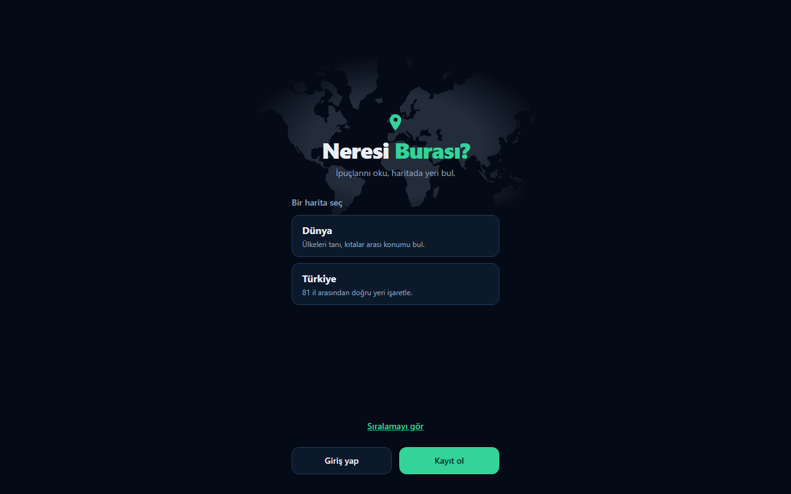
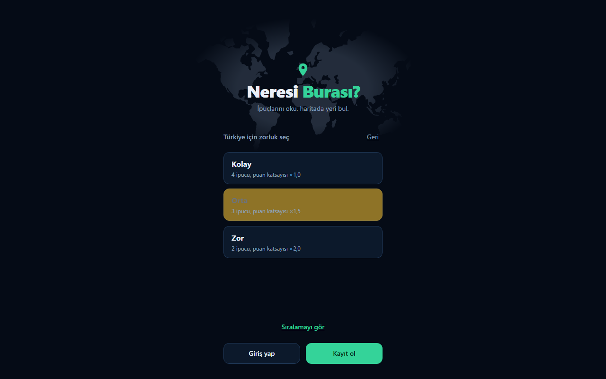
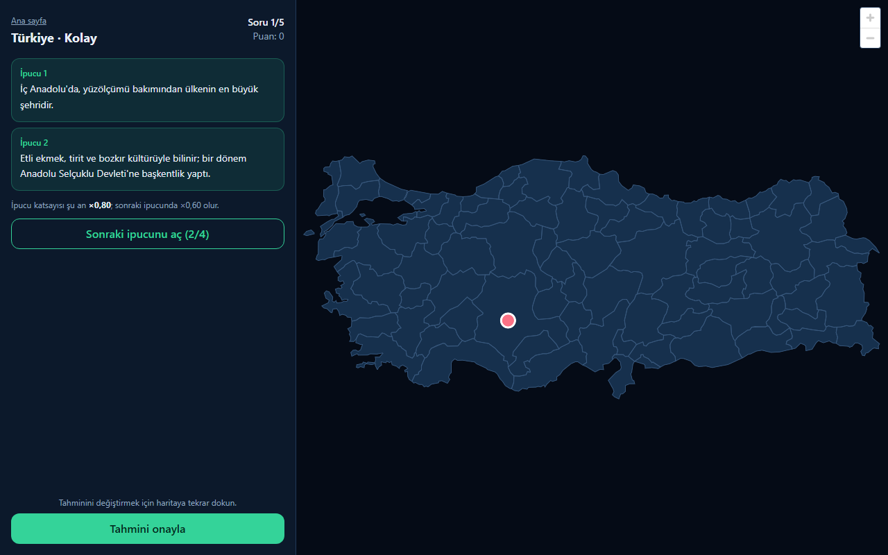
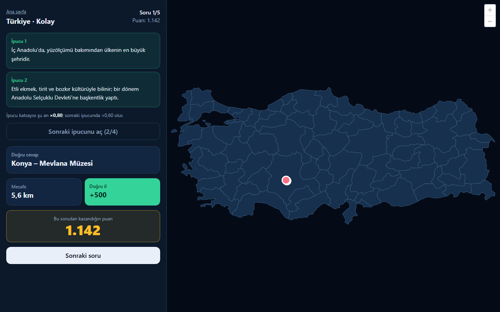
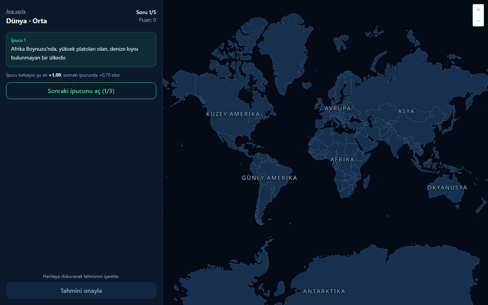
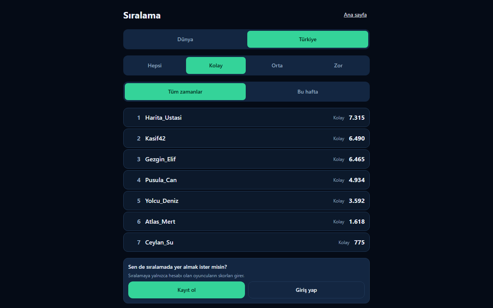
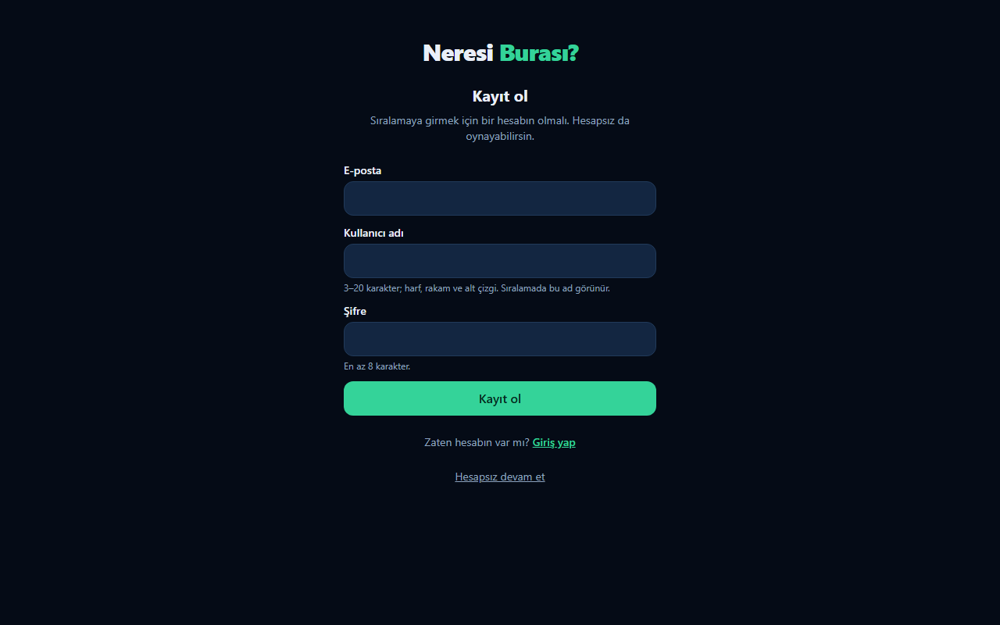
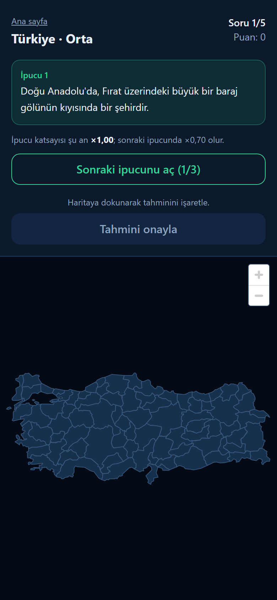
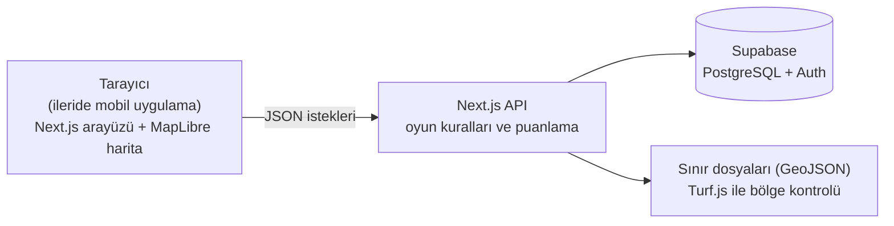

<div align="center">

# 📍 Neresi Burası?

**İpuçlarını oku, haritada yeri bul.**

Dünya ve Türkiye haritalarında oynanan, Türkçe bir coğrafya bilgi oyunu.



</div>

## Oyun nedir?

Sana bir yerin ipuçları verilir; sen de haritada o yeri bulmaya çalışırsın. Her oyun **5 sorudan** oluşur. İpuçları genelden özele doğru gider: ilkini ücretsiz görürsün, daha fazlasını açmak istersen puanından feda edersin. Haritaya dokunup tahminini işaretlersin; tahmin doğru yere ne kadar yakınsa o kadar çok puan kazanırsın.

- 🌍 **İki harita:** Dünya (ülkeler) ve Türkiye (81 il)
- 🎚️ **Üç zorluk:** Kolay, Orta, Zor. Zorlaştıkça ipucu azalır ama puan katsayısı artar.
- 📚 **150 soru:** Yapılar, doğa, yemek, tarih, kültür. Her oyunda rastgele 5 tanesi seçilir.
- 🏆 **Sıralama:** Hesabı olan oyuncuların skorları sıralamaya girer. Hesap açmadan da oynayabilirsin.
- 📱 **Mobil uyumlu:** Telefonda rahat kullanılır; ileride iOS/Android uygulamasına dönüştürülecek.

## Ekran görüntüleri

| Harita ve zorluk seçimi | Oyun ekranı |
|:---:|:---:|
|  |  |
| Önce harita, sonra zorluk seçilir. | Solda ipuçları, sağda harita. Tahmin haritaya dokunarak işaretlenir. |

| Sonuç ekranı | Dünya haritası |
|:---:|:---:|
|  |  |
| Doğru yer (yeşil), tahminin (kırmızı), mesafe ve puan. | Dünya haritasında ülke adları Türkçe; üzerine gelinen ülke vurgulanır. |

| Sıralama | Kayıt |
|:---:|:---:|
|  |  |
| Harita, zorluk ve döneme göre filtrelenir. | Sıralamaya girmek için kullanıcı adıyla kayıt olunur. |

<div align="center">


*Telefonda: ipuçları üstte, harita altta.*
</div>

## Nasıl çalışır?

### Oynanış

1. Harita (Dünya / Türkiye) ve zorluk seçilir.
2. Sunucu rastgele 5 soru seçer ve **yalnızca ilk ipucunu** gönderir.
3. İstenirse sonraki ipuçları tek tek açılır (her biri puanı düşürür).
4. Oyuncu haritaya dokunup tahminini işaretler ve **Tahmini onayla** der.
5. Sunucu mesafeyi ve puanı hesaplar; doğru konum ancak o zaman gösterilir.
6. 5 soru sonunda toplam puan görülür ve hesabı olan oyuncunun skoru sıralamaya girer.

### Puanlama

```
mesafePuanı = 1000 × e^(−mesafe_km / ölçek)     ölçek: Dünya 1500 km · Türkiye 75 km
bölgeBonusu = tahmin doğru ülke/il içindeyse +500
soruPuanı   = (mesafePuanı + bölgeBonusu) × ipucuKatsayısı × zorlukKatsayısı
```

| Zorluk | İpucu sayısı | Zorluk katsayısı | İpucu katsayıları (1 → son ipucu) |
|---|:---:|:---:|---|
| Kolay | 4 | ×1,0 | 1,00 · 0,80 · 0,60 · 0,40 |
| Orta | 3 | ×1,5 | 1,00 · 0,70 · 0,45 |
| Zor | 2 | ×2,0 | 1,00 · 0,60 |

### Mimari



Oyun mantığı arayüzde değil **API'de** durur; mobil uygulama da aynı uç noktaları kullanacak.

### Hileye karşı

- Doğru cevabın koordinatı ve bölge kodu, **tahmin yapılmadan önce istemciye hiç gönderilmez**.
- Açılmamış ipuçları gönderilmez; her ipucu ayrı istekle alınır ve sayısı sunucuda tutulur.
- Mesafe, bölge kontrolü ve puan **yalnızca sunucuda** hesaplanır; istemcinin puanına güvenilmez.
- Aynı soruya ikinci tahmin ve bitmiş oyuna tahmin kabul edilmez.
- Veritabanı tablolarına istemci doğrudan erişemez (Row Level Security).

## Kullanılan teknolojiler

| | Teknoloji | Ne için? |
|---|---|---|
| 🖥️ | **Next.js 16** (App Router) + **TypeScript** | Arayüz ve API tek projede |
| 🗺️ | **MapLibre GL JS** | Harita; altlık harita yok, yalnızca kendi GeoJSON katmanlarımız |
| 📐 | **Turf.js** | Mesafe (haversine) ve "nokta hangi ülkede/ilde" kontrolü |
| 🗄️ | **Supabase** (PostgreSQL + Auth) | Sorular, oyunlar, hesaplar ve sıralama |
| 🎨 | **Tailwind CSS 4** | Mobil öncelikli, koyu tema |
| ✅ | **Zod** | Tüm API girdilerinin doğrulanması |
| 🧪 | **Vitest** | Puanlama, coğrafi hesap, oyun kuralları ve soru kalitesi testleri |
| ☁️ | **Vercel** *(planlanan)* | Yayın |
| 📱 | **Capacitor** *(planlanan)* | iOS/Android uygulaması |

Harita sınırları [Natural Earth](https://www.naturalearthdata.com/) (kamu malı) kaynaklıdır. Etiket fontu Noto Sans'tır ve Türkçe karakterleri destekler.

## Çalıştırma

Gereksinimler: Node.js 24 ve bir [Supabase](https://supabase.com) projesi.

```bash
npm install
cp .env.example .env      # .env dosyasındaki 3 Supabase anahtarını doldur
npm run seed:questions    # soruları veritabanına yükle (önce supabase/migrations uygulanmalı)
npm run dev               # http://localhost:3000
```

| Komut | İş |
|---|---|
| `npm run dev` | Geliştirme sunucusu |
| `npm run build` · `npm run start` | Üretim derlemesi ve sunucusu |
| `npm run lint` · `npm run typecheck` · `npm run test` | Kod denetimleri |
| `npm run seed:questions` | Soruları Supabase'e yükler |

> `SUPABASE_SERVICE_ROLE_KEY` veritabanı korumasını aşar: yalnızca sunucuda kullanılır, kimseyle paylaşılmaz ve git'e eklenmez (`.env` zaten `.gitignore` içindedir).

## Proje yapısı

```
app/            Sayfalar ve API uç noktaları (oyun, hesap, sıralama)
components/     Arayüz bileşenleri (harita, oyun ekranları, hesap, sıralama)
lib/            Oyun kuralları, puanlama, coğrafi hesaplar, hesap işlemleri
data/           Soru dosyaları ve sunucudaki bölge kontrolü için sınır verisi
public/geo/     Haritada çizilen GeoJSON dosyaları ve fontlar
supabase/       Veritabanı şeması (migration dosyaları)
tests/          Birim testleri
docs/           README ekran görüntüleri
```

Oyun kuralları, kararlar ve proje kurallarının tamamı için [`CLAUDE.md`](CLAUDE.md) dosyasına bak.

## Yol haritası

- [x] Dünya ve Türkiye haritaları, üç zorluk seviyesi, puanlama
- [x] 150 soruluk havuz (harita ve zorluk başına 25)
- [x] Hesaplar ve sıralama
- [x] Google ile giriş ve şifre sıfırlama (kod hazır; Google ve e-posta ayarları Supabase panelinden yapılır)
- [ ] Yayın (Vercel), hız sınırı, özel e-posta servisi ve e-posta doğrulaması, gizlilik metni
- [ ] Soru havuzunu harita ve zorluk başına 50'ye çıkarma
- [ ] iOS ve Android uygulamaları (Capacitor)
